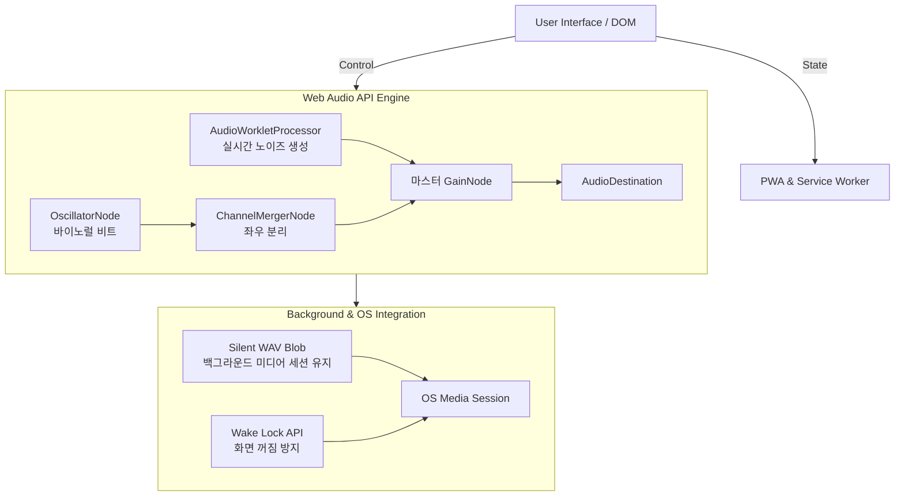

# Deep_Sleep_app

본 프로젝트는 수면 유도를 위한 4-7-8 호흡 가이드 및 수면 사운드를 제공하는 웹 애플리케이션이다. 
웹 기술만으로 네이티브 앱 수준의 백그라운드 재생을 지원하며, 오프라인 환경에서도 동작하도록 설계되었다.
*참고: 바이노럴 비트 사운드의 효과적인 청취를 위해 이어폰 또는 헤드폰 착용을 권장한다.*

**[수면 앱 바로 가기](https://rbtjd215.github.io/Deep_Sleep_app/)**  
**[수면 앱 가이드 보기](GUIDE.md)**

---

## 1. 앱 실행 화면 (Screenshots)

<div style="display: flex; gap: 10px;">
  
  
</div>

---

## 2. 시스템 아키텍처 (System Architecture)

본 애플리케이션은 오디오 제어와 백그라운드 환경을 안정적으로 제공하기 위해 아래와 같은 구조로 설계되었다.



---

## 3. 핵심 기술 및 구현 상세 (Implementation Details)

### 3.1. 실시간 노이즈 오디오 생성 (Real-time Noise Generation)
자연스러운 수면을 유도하기 위해 `AudioWorklet`을 활용하여 별도의 오디오 스레드에서 백색 소음(White Noise) 기반의 핑크 노이즈와 브라운 노이즈를 실시간으로 샘플 단위 연산하여 출력한다.

*   **Pink Noise:** Paul Kellet의 최적화 알고리즘을 적용하여 백색 소음에 여러 저주파 통과 필터를 직렬 연산해 1/f 특성을 구현한다.
*   **Brown Noise:** 좌우 채널을 분리하여 무작위 행보 누적(Random walk accumulation) 방식으로 묵직한 베이스 에너지를 유지한다.

```javascript
class NoiseProcessor extends AudioWorkletProcessor {
    constructor(options) {
        super();
        this.kind = options.processorOptions.kind || 'pink';
        this.amp  = options.processorOptions.amplitude || 0.25;
        this.p = new Float64Array(7); // 핑크 노이즈 계수
        this.bL = 0; this.bR = 0;     // 브라운 노이즈 누적기
    }

    process(inputs, outputs) {
        const outL = outputs[0][0];
        const outR = outputs[0][1];

        if (this.kind === 'pink') {
            for (let i = 0; i < outL.length; i++) {
                const w = Math.random() * 2 - 1;
                this.p[0] = 0.99886 * this.p[0] + w * 0.0555179;
                this.p[1] = 0.99332 * this.p[1] + w * 0.0750759;
                this.p[2] = 0.96900 * this.p[2] + w * 0.1538520;
                this.p[3] = 0.86650 * this.p[3] + w * 0.3104856;
                this.p[4] = 0.55000 * this.p[4] + w * 0.5329522;
                this.p[5] = -0.7616 * this.p[5] - w * 0.0168980;
                const val = (this.p[0]+this.p[1]+this.p[2]+this.p[3]+this.p[4]+this.p[5]+this.p[6]+w*0.5362) * 0.11 * this.amp;
                this.p[6] = w * 0.115926;
                outL[i] = outR[i] = val;
            }
        } else {
            for (let i = 0; i < outL.length; i++) {
                this.bL = (this.bL + (Math.random() * 2 - 1) * 0.02) * 0.998;
                this.bR = (this.bR + (Math.random() * 2 - 1) * 0.02) * 0.998;
                outL[i] = this.bL * this.amp * 8;
                outR[i] = this.bR * this.amp * 8;
            }
        }
        return true;
    }
}
```

### 3.2. 모바일 백그라운드 오디오 지속 (Background Audio Persistence)
모바일 브라우저 환경에서 화면이 꺼지더라도 오디오가 지속해서 재생되도록, 무음(Silent) WAV 파일을 동적으로 생성하여 무한 루프 시키는 방식을 적용했다.

`ArrayBuffer`와 `DataView`를 이용해 오디오 파일의 필수 규격인 44바이트 헤더를 조립하고 샘플 데이터를 `0`으로 채워 브라우저 메모리에 즉석에서 Blob 객체를 만든다.

```javascript
function createSilentWAV() {
    const sr = 22050, dur = 1, ch = 1, bps = 16;
    const len = sr * dur;
    const data = len * ch * (bps / 8);
    const size = 44 + data;
    const buf = new ArrayBuffer(size);
    const dv = new DataView(buf);
    const ws = (o, s) => { for (let i=0; i<s.length; i++) dv.setUint8(o+i, s.charCodeAt(i)); };
    
    ws(0, 'RIFF'); dv.setUint32(4, size - 8, true); ws(8, 'WAVE'); ws(12, 'fmt ');
    dv.setUint32(16, 16, true); dv.setUint16(20, 1, true); dv.setUint16(22, ch, true);
    dv.setUint32(24, sr, true); dv.setUint32(28, sr * ch * (bps / 8), true);
    dv.setUint16(32, ch * (bps / 8), true); dv.setUint16(34, bps, true);
    ws(36, 'data'); dv.setUint32(40, data, true);
    
    return new Blob([buf], { type: 'audio/wav' });
}

// 생성된 Blob을 숨겨진 오디오 요소에 연결하여 무한 재생
silentBlobUrl = URL.createObjectURL(createSilentWAV());
silentAudio = new Audio(silentBlobUrl);
silentAudio.loop = true;
silentAudio.play();
```

### 3.3. 바이노럴 비트 엔진 (Binaural Beat Engine)
양쪽 귀에 미세하게 다른 주파수를 들려주어 뇌파 동조(Delta, Theta)를 유도한다. `OscillatorNode` 2개와 `ChannelMergerNode`를 결합하여 좌우 채널을 물리적으로 분리했다. 왼쪽 귀에 100Hz, 오른쪽 귀에 103Hz를 독립적으로 출력하여 두 주파수의 차이인 3Hz(델타파)를 내부적으로 합성해 인식하도록 한다.

```javascript
const merger = ctx.createChannelMerger(2);

// 왼쪽 채널 오실레이터 (기준 주파수 100Hz)
const oscL = ctx.createOscillator();
oscL.frequency.value = 100;
oscL.connect(ctx.createGain()).connect(merger, 0, 0);

// 오른쪽 채널 오실레이터 (기준 + 목표 뇌파 주파수 3Hz = 103Hz)
const oscR = ctx.createOscillator();
oscR.frequency.value = 100 + 3;
oscR.connect(ctx.createGain()).connect(merger, 0, 1);

merger.connect(sleepGainNode);
```

---

## 4. 화면 제어 및 PWA 통합

*   **Wake Lock API**: 호흡 가이드(4-7-8)를 따라 하는 동안 스마트폰 화면이 자동 절전모드로 꺼지는 것을 방지한다. (`navigator.wakeLock.request('screen')`)
*   **Media Session API**: 잠금 화면 및 알림창 컨트롤러에 현재 재생 중인 사운드 정보를 동기화하여 네이티브 앱처럼 백그라운드 컨트롤을 제공한다.
*   **PWA (Progressive Web App)**: 
    *   `manifest.json`: 앱 아이콘, 테마 색상, 독립형(Standalone) 모드를 지정한다.
    *   `sw.js` (Service Worker): 핵심 자원을 브라우저 캐시에 저장하여 오프라인 환경에서도 안정적으로 동작한다.

---

## 5. 트러블슈팅 (Troubleshooting)

개발 과정에서 직면한 주요 기술적 문제와 해결 과정은 다음과 같다.

### 5.1. 오디오 버퍼 루프 간극 (Audio Gap) 현상 해결
*   **문제:** 초기에 `HTML5 Audio` 및 `Web Audio API`의 `loop = true` 속성을 사용하여 오디오 버퍼를 반복 재생했을 때, 브라우저 오디오 엔진 구조상 반복 경계에서 미세하게 소리가 끊기거나 튀는 현상(Gap)이 발생했다.
*   **해결:** 버퍼 기반 재생 방식을 완전히 폐기하고, `AudioWorklet`을 도입하여 메인 스레드와 독립된 환경에서 노이즈 파형을 실시간으로 무한 생성하도록 구조를 개편했다. 이로써 루프 경계 자체가 존재하지 않게 되어 끊김 현상을 근본적으로 해결했다.

### 5.2. 모바일 백그라운드 오디오 차단 우회
*   **문제:** iOS 등 모바일 OS는 화면이 꺼지면 배터리 절약을 위해 오디오 컨텍스트를 강제로 중지시켜 수면 사운드가 끊기는 문제가 있었다.
*   **해결:** 자바스크립트로 1초 길이의 무음 WAV 파형을 바이너리로 동적 생성하고, 이를 보이지 않는 `<audio>` 태그에서 백그라운드 재생시키는 방식으로 OS의 미디어 세션을 속여 백그라운드 재생을 유지했다.

### 5.3. 페이드아웃 및 볼륨 조절 충돌 방지
*   **문제:** 수면 모드 종료 1분 전부터 서서히 소리가 줄어들도록(Fade-out) 타이머 기반으로 `gain.value`를 수동 조작했을 때, 사용자의 수동 볼륨 조절 이벤트와 상태가 엉켜 소리가 튀는 버그가 발생했다.
*   **해결:** Web Audio API의 스케줄링 메서드인 `linearRampToValueAtTime()`을 활용하여 오디오 엔진 하드웨어 계층이 자체적으로 페이드아웃을 처리하도록 위임하여 상태 충돌을 방지했다.

### 5.4. 슬라이더 UI 렌더링 글리치(Glitch) 해결
*   **문제:** 볼륨 슬라이더를 빠르게 조절할 때 동그라미(Thumb)가 이중으로 분리되거나 잔상이 남는 브라우저 렌더링 지연 문제가 발생했다.
*   **해결:** 슬라이더 요소에 CSS `will-change: transform` 속성을 부여해 GPU 가속을 유도하고, 오디오 컨텍스트 조작 이벤트를 분리하여 메인 스레드의 렌더링 병목을 완화했다.

---

## 6. 로컬 실행 방법 (Local Development)

본 프로젝트는 `AudioWorklet`과 `Service Worker`를 사용하므로, 브라우저 보안 정책상 로컬 파일 열기(`file://`) 방식으로는 정상 동작하지 않는다.

1.  저장소를 클론한다.
    ```bash
    git clone https://github.com/rbtjd215/Deep_Sleep.git
    ```
2.  VSCode의 **Live Server** 확장 프로그램을 사용하거나, 터미널에서 로컬 서버를 실행한다.
    ```bash
    npx serve .
    ```
3.  브라우저에서 서버 주소(예: `http://localhost:3000`)로 접속한다.

---

## 7. License
본 프로젝트는 MIT 라이선스 하에 배포된다.
