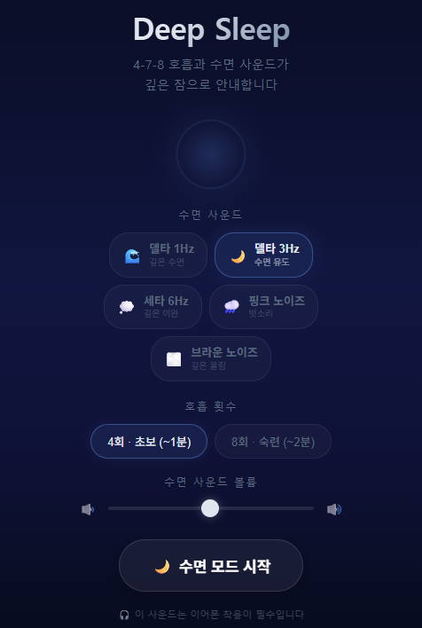
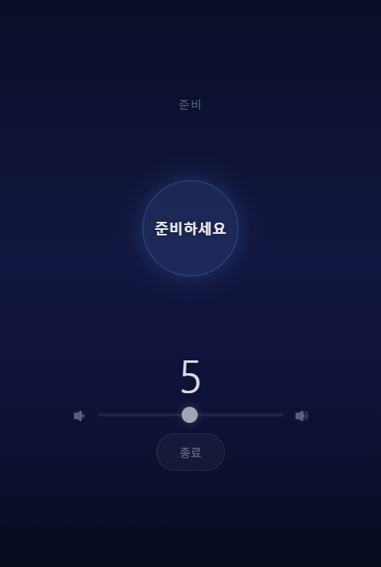
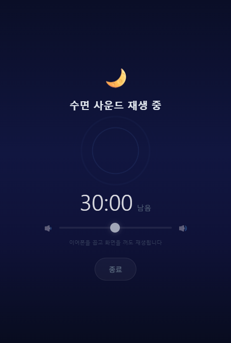
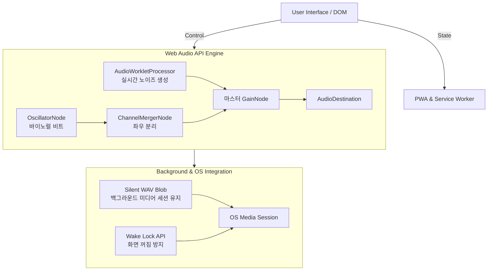

# Deep_Sleep_app

본 프로젝트는 수면 유도를 위한 4-7-8 호흡 가이드 및 수면 사운드를 제공하는 웹 애플리케이션이다. 
기존 수면 앱들이 과도한 유료 결제를 강요하는 것에 불편함을 느껴, 누구나 제한 없이 사용할 수 있도록 전면 무료로 개발하였다.
웹 기술만으로 네이티브 앱 수준의 백그라운드 재생을 지원하며, 오프라인 환경에서도 동작하도록 설계되었다.
*참고: 바이노럴 비트 사운드의 효과적인 청취를 위해 이어폰 또는 헤드폰 착용을 권장한다.*

**[수면 앱 바로 가기](https://rbtjd215.github.io/Deep_Sleep_app/)**  
**[수면 앱 가이드 보기](GUIDE.md)**

---

## 주요 기능 (Features)

*   **4-7-8 호흡 가이드**: 시각적 애니메이션과 오디오 신호를 통한 직관적인 호흡 유도
*   **실시간 오디오 합성**: AudioWorklet 및 OscillatorNode를 활용하여 루프 끊김 현상이 없는 백색소음 및 바이노럴 비트 생성
*   **모바일 백그라운드 재생**: 기기 화면이 꺼진 상태에서도 오디오 세션이 끊기지 않도록 백그라운드 재생 환경 최적화
*   **오프라인 지원 (PWA)**: Service Worker를 적용하여 인터넷 연결이 없는 상태에서도 독립적인 네이티브 앱처럼 실행 가능
*   **전면 무료**: 결제 유도나 인앱 광고 없이 모든 기능을 제한 없이 완전 무료로 제공

---

## 1. 앱 실행 화면 (Screenshots)

<div style="display: flex; gap: 10px; overflow-x: auto;">
  
  
  
</div>

---

## 2. 시스템 아키텍처 (System Architecture)

본 애플리케이션은 오디오 제어와 백그라운드 환경을 제공하기 위해 아래와 같은 구조로 설계되었다.



---

## 3. 핵심 기술 및 구현 상세 (Implementation Details)

### 3.1. 실시간 노이즈 오디오 생성 (Real-time Noise Generation)
`AudioWorklet`을 활용하여 별도의 오디오 스레드에서 백색 소음(White Noise) 기반의 핑크 노이즈와 브라운 노이즈를 실시간으로 샘플 단위 연산하여 출력한다.

*   **Pink Noise:** Paul Kellet의 최적화 알고리즘을 적용하여 백색 소음에 여러 저주파 통과 필터를 직렬 연산해 1/f 특성을 구현한다.
*   **Brown Noise:** 좌우 채널을 분리하여 무작위 행보 누적(Random walk accumulation) 방식으로 저음역대 사운드를 구현한다.

```javascript
class NoiseProcessor extends AudioWorkletProcessor {
    constructor(options) {
        super();
        this.kind = options.processorOptions.kind || 'pink';
        this.amp  = options.processorOptions.amplitude || 0.25;
        this.p = new Float64Array(7); // 핑크 노이즈 계수
        this.bL = 0; this.bR = 0;     // 브라운 노이즈 누적기
    }

    process(inputs, outputs) {
        const outL = outputs[0][0];
        const outR = outputs[0][1];

        if (this.kind === 'pink') {
            for (let i = 0; i < outL.length; i++) {
                const w = Math.random() * 2 - 1;
                this.p[0] = 0.99886 * this.p[0] + w * 0.0555179;
                this.p[1] = 0.99332 * this.p[1] + w * 0.0750759;
                this.p[2] = 0.96900 * this.p[2] + w * 0.1538520;
                this.p[3] = 0.86650 * this.p[3] + w * 0.3104856;
                this.p[4] = 0.55000 * this.p[4] + w * 0.5329522;
                this.p[5] = -0.7616 * this.p[5] - w * 0.0168980;
                const val = (this.p[0]+this.p[1]+this.p[2]+this.p[3]+this.p[4]+this.p[5]+this.p[6]+w*0.5362) * 0.11 * this.amp;
                this.p[6] = w * 0.115926;
                outL[i] = outR[i] = val;
            }
        } else {
            for (let i = 0; i < outL.length; i++) {
                this.bL = (this.bL + (Math.random() * 2 - 1) * 0.02) * 0.998;
                this.bR = (this.bR + (Math.random() * 2 - 1) * 0.02) * 0.998;
                outL[i] = this.bL * this.amp * 8;
                outR[i] = this.bR * this.amp * 8;
            }
        }
        return true;
    }
}
```

### 3.2. 모바일 백그라운드 오디오 지속 및 브릿징 (Background Audio Bridging)
모바일 브라우저(특히 iOS Safari)는 기기 화면이 꺼질 경우 배터리 절약을 위해 DOM과 연결되지 않은 `AudioContext` 연산을 강제로 중단한다. 이를 근본적으로 해결하기 위해 오디오 브릿징 기법을 적용했다.

`AudioContext.createMediaStreamDestination()`을 활용하여 실시간으로 합성되는 수면 사운드를 `MediaStream`으로 변환한 뒤, 이를 숨겨진 `<audio>` 요소의 `srcObject`로 직접 연결한다. 이를 통해 OS의 미디어 세션이 웹 애플리케이션을 활성 미디어 스트리밍 프로세스로 인식하게 유도하여, 백그라운드 환경에서도 사운드 출력이 중단되지 않도록 보장한다.

```javascript
// Web Audio API의 출력을 MediaStream으로 변환
destNode = audioCtx.createMediaStreamDestination();

// 마스터 오디오 요소 생성 및 스트림 연결
masterAudio = document.createElement('audio');
masterAudio.setAttribute('playsinline', '');
masterAudio.srcObject = destNode.stream;
masterAudio.play();

// 모든 사운드 출력을 destNode로 라우팅
sleepGainNode.connect(destNode);
```

### 3.3. 바이노럴 비트 엔진 (Binaural Beat Engine)
양쪽 귀에 미세하게 다른 주파수를 들려주어 뇌파 동조(Delta, Theta)를 유도한다. `OscillatorNode` 2개와 `ChannelMergerNode`를 결합하여 좌우 채널을 분리했다. 왼쪽 귀에 100Hz, 오른쪽 귀에 103Hz를 독립적으로 출력하여 두 주파수의 차이인 3Hz(델타파)를 내부적으로 합성해 인식하도록 한다.

```javascript
const merger = ctx.createChannelMerger(2);

// 왼쪽 채널 오실레이터 (기준 주파수 100Hz)
const oscL = ctx.createOscillator();
oscL.frequency.value = 100;
oscL.connect(ctx.createGain()).connect(merger, 0, 0);

// 오른쪽 채널 오실레이터 (기준 + 목표 뇌파 주파수 3Hz = 103Hz)
const oscR = ctx.createOscillator();
oscR.frequency.value = 100 + 3;
oscR.connect(ctx.createGain()).connect(merger, 0, 1);

merger.connect(sleepGainNode);
```

---

## 4. 화면 제어 및 PWA 통합

*   **Wake Lock API**: 호흡 가이드(4-7-8)를 따라 하는 동안 스마트폰 화면이 자동 절전모드로 꺼지는 것을 방지한다. (`navigator.wakeLock.request('screen')`)
*   **Media Session API**: 잠금 화면 및 알림창 컨트롤러에 현재 재생 중인 사운드 정보를 동기화하여 네이티브 앱처럼 백그라운드 컨트롤을 제공한다.
*   **PWA (Progressive Web App)**: 
    *   `manifest.json`: 앱 아이콘, 테마 색상, 독립형(Standalone) 모드를 지정한다.
    *   `sw.js` (Service Worker): 핵심 자원을 브라우저 캐시에 저장하여 오프라인 환경에서도 안정적으로 동작한다.

---

## 5. 트러블슈팅 (Troubleshooting)

개발 과정에서 직면한 주요 기술적 문제와 해결 과정은 다음과 같다.

### 5.1. 오디오 버퍼 루프 간극 (Audio Gap) 현상 해결
*   **문제:** 초기에 `HTML5 Audio` 및 `Web Audio API`의 `loop = true` 속성을 사용하여 오디오 버퍼를 반복 재생했을 때, 브라우저 오디오 엔진 구조상 반복 경계에서 미세하게 소리가 끊기거나 튀는 현상(Gap)이 발생했다.
*   **해결:** 버퍼 기반 재생 방식을 폐기하고, `AudioWorklet`을 도입하여 메인 스레드와 독립된 환경에서 노이즈 파형을 실시간으로 무한 생성하도록 구조를 개편했다. 이로써 루프 경계 자체가 존재하지 않게 되어 끊김 현상을 해결했다.

### 5.2. 모바일 백그라운드 오디오 프로세스 중단 (Background Suspension) 현상 해결
*   **문제:** iOS 15 이상의 최신 모바일 OS에서는 `<audio>` 요소와 직접적으로 스트림이 연결되지 않은 `AudioContext`를 백그라운드 진입 시 즉각적으로 중단(Suspend)시킨다. 이로 인해 오디오 출력이 급격히 차단되며 팝 노이즈(Pop noise, "툭" 소리)가 발생하는 문제가 확인되었다. 기존의 독립적인 무음 오디오 파일을 재생하여 세션을 유지하는 방식은 더 이상 유효하지 않았다.
*   **해결:** `MediaStreamDestination` 노드를 도입하여 `AudioContext`의 출력 스트림(`MediaStream`)을 생성하고, 이를 활성화된 `<audio>` 요소의 `srcObject`로 공급하는 오디오 브릿징 아키텍처를 적용하였다. 이를 통해 오디오 컨텍스트가 미디어 요소의 종속 소스로 취급되도록 하여 백그라운드 실행 권한을 안정적으로 확보했다.

### 5.3. 백그라운드 자바스크립트 타이머 지연 (Timer Throttling) 현상 해결
*   **문제:** 호흡 가이드(4-7-8)의 초 세기를 `setInterval`로 구현했으나, 모바일 화면이 꺼지면 자바스크립트 타이머가 심각하게 지연(Throttling)되어 1초 간격의 틱 소리가 5~10초 단위로 느려지는 현상이 발생했다.
*   **해결:** 타이머 함수에 의존하지 않고, 시작 버튼을 누르는 즉시 Web Audio API의 `audioCtx.currentTime`을 이용해 향후 수 분간 재생될 모든 틱과 차임벨 소리를 1초 단위로 사전 스케줄링(Pre-scheduling)하였다. 화면 꺼짐 여부와 상관없이 오디오 엔진의 절대 시계에 맞춰 오차 없이 재생되도록 구현했다.

### 5.4. 페이드아웃 및 볼륨 조절 충돌 방지
*   **문제:** 수면 모드 종료 1분 전부터 서서히 소리가 줄어들도록(Fade-out) 타이머 기반으로 `gain.value`를 수동 조작했을 때, 사용자의 수동 볼륨 조절 이벤트와 상태가 엉켜 소리가 튀는 버그가 발생했다.
*   **해결:** Web Audio API의 스케줄링 메서드인 `linearRampToValueAtTime()`을 활용하여 오디오 엔진 하드웨어 계층이 자체적으로 페이드아웃을 처리하도록 위임하여 상태 충돌을 방지했다.

### 5.5. 슬라이더 UI 렌더링 글리치(Glitch) 해결
*   **문제:** 볼륨 슬라이더를 빠르게 조절할 때 동그라미(Thumb)가 이중으로 분리되거나 잔상이 남는 브라우저 렌더링 지연 문제가 발생했다.
*   **해결:** 슬라이더 요소에 CSS `will-change: transform` 속성을 부여해 GPU 가속을 유도하고, 오디오 컨텍스트 조작 이벤트를 분리하여 메인 스레드의 렌더링 병목을 완화했다.

---

## 6. 로컬 실행 방법 (Local Development)

본 프로젝트는 `AudioWorklet`과 `Service Worker`를 사용하므로, 브라우저 보안 정책상 로컬 파일 열기(`file://`) 방식으로는 정상 동작하지 않는다.

1.  저장소를 클론한다.
    ```bash
    git clone https://github.com/rbtjd215/Deep_Sleep_app.git
    ```
2.  VSCode의 **Live Server** 확장 프로그램을 사용하거나, 터미널에서 로컬 서버를 실행한다.
    ```bash
    npx serve .
    ```
3.  브라우저에서 서버 주소(예: `http://localhost:3000`)로 접속한다.

---

## 7. License
본 프로젝트는 MIT 라이선스 하에 배포된다.
