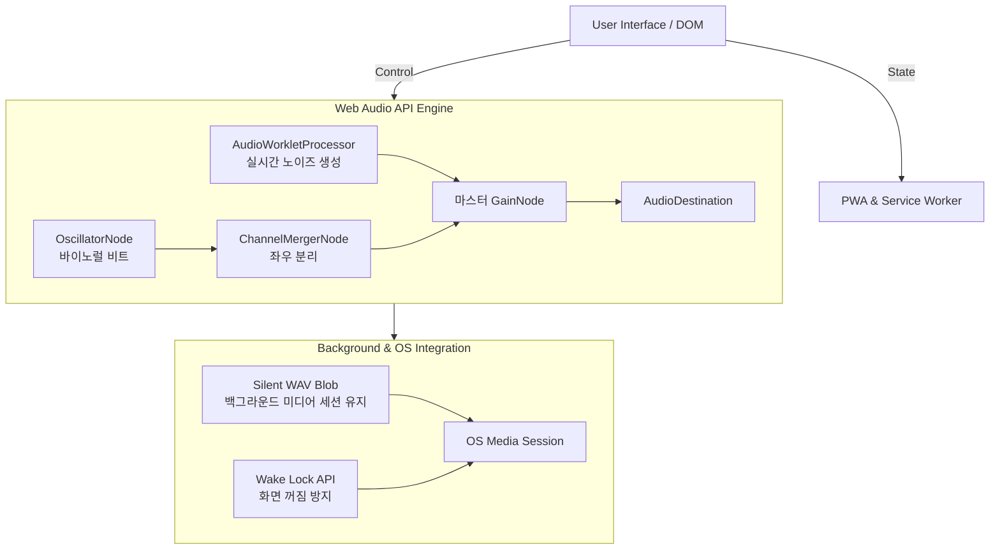

# Deep_Sleep_app

본 프로젝트는 수면 유도를 위한 4-7-8 호흡 가이드 및 수면 사운드를 제공하는 웹 애플리케이션입니다. 
웹 기술만으로 네이티브 앱 수준의 백그라운드 재생을 지원하며, 오프라인 환경에서도 동작하도록 설계되었습니다.
*참고: 바이노럴 비트 사운드의 효과적인 청취를 위해 이어폰 또는 헤드폰 착용을 권장합니다.*

**[수면 앱 바로 가기](https://rbtjd215.github.io/Deep_Sleep_app/)**  
**[수면 앱 가이드 보기](GUIDE.md)**

---

## 1. 스크린샷 (Screenshots)
*(여기에 앱 실행 화면이나 호흡 애니메이션 GIF를 추가하세요)*

---

## 2. 시스템 아키텍처 (System Architecture)

본 애플리케이션은 오디오 제어와 백그라운드 환경을 제공하기 위해 아래와 같은 구조로 설계되었습니다.



---

## 3. 핵심 기술 및 트러블슈팅 (Implementation & Troubleshooting)

### 3.1. 실시간 노이즈 오디오 생성 (Real-time Noise Generation)
* **문제 (Trouble):** 초기 구현에서는 `HTML5 Audio` 및 `Web Audio API`의 `AudioBufferSourceNode.loop = true` 속성을 사용하여 미리 생성된 노이즈 버퍼를 반복 재생했습니다. 그러나 브라우저 오디오 엔진의 특성상 반복 지점에서 미세한 간극(Gap)이 발생하여 수면 유도용 사운드에 적합하지 않은 끊김 현상이 발생했습니다.
* **해결 (Shooting):** 버퍼 반복 방식을 폐기하고, `AudioWorklet`을 도입하여 별도의 오디오 스레드에서 샘플 단위로 오디오 파형을 실시간 생성하도록 구조를 변경했습니다. 루프 경계 자체를 없애어 끊김 현상을 원천 차단했습니다.
* **구현 상세:**
  * **Pink Noise:** Paul Kellet의 최적화 알고리즘을 적용하여 백색 소음에 여러 저주파 통과 필터를 직렬 연산해 1/f 특성을 구현했습니다.
  * **Brown Noise:** 좌우 채널을 분리하여 무작위 행보 누적(Random walk accumulation) 방식으로 묵직한 베이스 에너지를 유지합니다.

### 3.2. 모바일 백그라운드 오디오 지속 (Background Audio Persistence)
* **문제 (Trouble):** 모바일 OS(특히 iOS) 특성상 사용자가 화면을 끄거나 앱을 백그라운드로 전환하면 브라우저의 오디오 컨텍스트가 즉각 중지되어 수면 사운드 재생이 끊기는 문제가 발생했습니다.
* **해결 (Shooting):** 자바스크립트로 1초 길이의 무음(Silent) WAV 파일을 바이너리(Blob) 레벨에서 직접 생성하고, 이를 보이지 않는 `<audio>` 태그에서 무한 반복 재생시켰습니다. 이를 통해 OS의 미디어 세션을 유지하여 백그라운드 재생이 끊기지 않도록 우회 구현했습니다.
* **구현 상세:** `ArrayBuffer`와 `DataView`를 이용해 오디오 파일의 필수 규격인 44바이트 헤더를 조립하고 샘플 데이터 영역을 `0`으로 채워 Blob 객체를 생성합니다.

### 3.3. 바이노럴 비트 엔진 (Binaural Beat Engine)
* **구현 상세:** 양쪽 귀에 미세하게 다른 주파수를 들려주어 뇌파 동조(Delta, Theta)를 유도합니다. `OscillatorNode` 2개와 `ChannelMergerNode`를 결합하여 좌우 채널을 물리적으로 엄격하게 분리했습니다. 예를 들어 왼쪽 귀에 100Hz, 오른쪽 귀에 103Hz를 출력하여 사용자가 두 주파수의 차이인 3Hz(델타파)를 내부적으로 합성해 인식하도록 구현했습니다.

### 3.4. 오디오 제어 및 렌더링 최적화
* **페이드아웃 충돌 해결:** 수면 모드 종료 1분 전부터 서서히 소리가 줄어들도록(Fade-out) 타이머 기반으로 `gain.value`를 수동 조작했을 때, 사용자의 볼륨 조절과 상태가 충돌하는 문제가 있었습니다. 이를 Web Audio API의 스케줄링 메서드인 `linearRampToValueAtTime()`을 활용하여 오디오 엔진이 자체적으로 부드럽게 페이드아웃을 처리하도록 위임하여 해결했습니다.
* **슬라이더 렌더링 버그 수정:** 볼륨 슬라이더를 빠르게 조절할 때 동그라미(Thumb) UI가 이중으로 분리되거나 잔상이 남는 브라우저 렌더링 버그가 발생했습니다. CSS `will-change: transform`을 통한 GPU 가속 힌트를 추가하고, 이벤트 리스너와 오디오 노드 업데이트를 최적화하여 렌더링 끊김을 해결했습니다.

---

## 4. 로컬 실행 방법 (Local Development)

본 프로젝트는 `AudioWorklet`과 `Service Worker`를 사용하므로, 브라우저 보안 정책상 로컬 파일 열기(`file://`) 방식으로는 정상 동작하지 않습니다.

1. 저장소를 클론합니다.
   ```bash
   git clone https://github.com/rbtjd215/Deep_Sleep.git
   ```
2. VSCode의 **Live Server** 확장 프로그램을 사용하거나, 터미널에서 로컬 서버를 실행합니다.
   ```bash
   npx serve .
   ```
3. 브라우저에서 서버 주소(예: `http://localhost:3000`)로 접속합니다.

---

## 5. PWA (Progressive Web App) 통합
* `manifest.json`: 앱 아이콘, 테마 색상, 독립형(Standalone) 모드를 지정하여 설치 시 브라우저 주소창을 제거합니다.
* `sw.js` (Service Worker): 핵심 자원(HTML, JS, CSS, 오디오 파일)을 브라우저 캐시에 저장하여 오프라인 환경에서도 안정적으로 동작합니다.

---

## 6. License
본 프로젝트는 MIT 라이선스 하에 배포됩니다.
