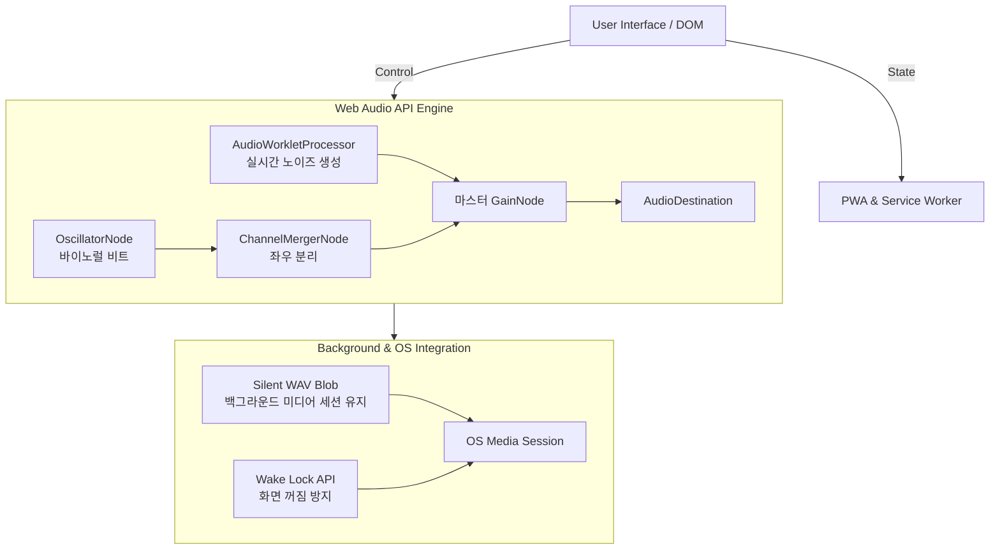

# Deep Sleep app

본 프로젝트는 수면 유도를 위한 4-7-8 호흡 가이드 및 수면 사운드를 제공하는 웹 애플리케이션이다. 
시중에 출시된 유료 수면 앱의 무분별한 결제 유도 및 구독 시스템에 불편함을 느껴, 순수 웹 기술만으로 백그라운드 재생이 완벽히 지원되는 무료 앱을 직접 개발하였다.

**Live Demo**: [https://rbtjd215.github.io/Deep_Sleep/](https://rbtjd215.github.io/Deep_Sleep/)

---

## 1. 시스템 아키텍처 (System Architecture)

본 애플리케이션은 네이티브 앱 수준의 오디오 제어와 백그라운드 환경을 제공하기 위해 아래와 같은 구조로 설계되었다.



---

## 2. 핵심 기술 및 구현 상세 (Implementation Details)

### 2.1. 완벽한 오디오 루프 구현 (Seamless Audio Loop)
HTML5 `<audio>` 태그의 고질적인 루프 간극(Gap, 끊김 현상) 문제를 해결하기 위해, 미리 녹음된 오디오 파일을 반복하는 대신 수학적 알고리즘을 통해 실시간으로 샘플을 무한 생성한다.

**AudioWorkletProcessor 알고리즘 (Pink & Brown Noise)**
핑크 노이즈는 Paul Kellet의 경제적인 필터 최적화 알고리즘을 변형하여 구현하였고, 브라운 노이즈는 이전 샘플 값에 랜덤 값을 누적(Accumulate)하는 방식으로 저주파 에너지를 강조하였다.

```javascript
class NoiseProcessor extends AudioWorkletProcessor {
    constructor(options) {
        super();
        this.kind = options.processorOptions.kind || 'pink';
        this.amp  = options.processorOptions.amplitude || 0.25;
        this.p = new Float64Array(7); // 핑크 노이즈 계수
        this.bL = 0; this.bR = 0;     // 브라운 노이즈 누적기
    }

    process(inputs, outputs) {
        const outL = outputs[0][0];
        const outR = outputs[0][1];

        if (this.kind === 'pink') {
            for (let i = 0; i < outL.length; i++) {
                const w = Math.random() * 2 - 1;
                this.p[0] = 0.99886 * this.p[0] + w * 0.0555179;
                this.p[1] = 0.99332 * this.p[1] + w * 0.0750759;
                this.p[2] = 0.96900 * this.p[2] + w * 0.1538520;
                this.p[3] = 0.86650 * this.p[3] + w * 0.3104856;
                this.p[4] = 0.55000 * this.p[4] + w * 0.5329522;
                this.p[5] = -0.7616 * this.p[5] - w * 0.0168980;
                const val = (this.p[0]+this.p[1]+this.p[2]+this.p[3]+this.p[4]+this.p[5]+this.p[6]+w*0.5362) * 0.11 * this.amp;
                this.p[6] = w * 0.115926;
                outL[i] = outR[i] = val;
            }
        } else {
            // 브라운 노이즈: 이전 값에 난수를 더하여 누적
            for (let i = 0; i < outL.length; i++) {
                this.bL = (this.bL + (Math.random() * 2 - 1) * 0.02) * 0.998;
                this.bR = (this.bR + (Math.random() * 2 - 1) * 0.02) * 0.998;
                outL[i] = this.bL * this.amp * 8;
                outR[i] = this.bR * this.amp * 8;
            }
        }
        return true;
    }
}
```

### 2.2. 바이노럴 비트 엔진 (Binaural Beat Engine)
양쪽 귀에 미세하게 다른 주파수를 들려주어 뇌파 동조(Delta, Theta)를 유도한다. `OscillatorNode` 2개와 `ChannelMergerNode`를 결합하여 좌우 채널을 분리하였다.

```javascript
const merger = ctx.createChannelMerger(2);

// 왼쪽 채널 오실레이터 (기준 주파수)
const oscL = ctx.createOscillator();
oscL.frequency.value = 100; // 100Hz
oscL.connect(ctx.createGain()).connect(merger, 0, 0);

// 오른쪽 채널 오실레이터 (기준 + 목표 뇌파 주파수)
const oscR = ctx.createOscillator();
oscR.frequency.value = 100 + 3; // 103Hz (3Hz 델타파 유도)
oscR.connect(ctx.createGain()).connect(merger, 0, 1);

merger.connect(sleepGainNode);
```

### 2.3. 백그라운드 오디오 지속 기법 (Background Audio Persistence)
iOS Safari 등 모바일 브라우저에서는 사용자가 화면을 끄거나 앱을 내리면 자원 절약을 위해 AudioContext가 정지된다. 이를 우회하기 위해, 메모리 상에서 동적으로 **1초짜리 무음(Silent) 16-bit WAV 파일**을 바이너리 데이터로 생성하고 이를 `<audio>` 태그로 무한 루프 재생시키는 해킹 기법을 적용하였다.

```javascript
function createSilentWAV() {
    const sr = 22050, dur = 1, ch = 1, bps = 16;
    const len = sr * dur;
    const data = len * ch * (bps / 8);
    const size = 44 + data;
    const buf = new ArrayBuffer(size);
    const dv = new DataView(buf);
    const ws = (o, s) => { for (let i=0; i<s.length; i++) dv.setUint8(o+i, s.charCodeAt(i)); };
    
    ws(0, 'RIFF'); dv.setUint32(4, size - 8, true); ws(8, 'WAVE'); ws(12, 'fmt ');
    dv.setUint32(16, 16, true); dv.setUint16(20, 1, true); dv.setUint16(22, ch, true);
    dv.setUint32(24, sr, true); dv.setUint32(28, sr * ch * (bps / 8), true);
    dv.setUint16(32, ch * (bps / 8), true); dv.setUint16(34, bps, true);
    ws(36, 'data'); dv.setUint32(40, data, true); // 샘플 데이터는 기본값인 0(무음)으로 유지
    
    return new Blob([buf], { type: 'audio/wav' });
}

// 생성된 Blob을 숨겨진 오디오 요소에 연결하여 재생
silentBlobUrl = URL.createObjectURL(createSilentWAV());
silentAudio = new Audio(silentBlobUrl);
silentAudio.loop = true;
silentAudio.play();
```
이를 통해 OS는 앱이 미디어를 계속 재생 중인 것으로 인식하며 백그라운드 환경에서도 프로세스를 종료시키지 않는다.

### 2.4. 화면 제어 및 상태 동기화 (Wake Lock & Media Session)
* **Wake Lock API**: 호흡 가이드(4-7-8)를 눈으로 보고 따라 하는 동안 스마트폰 화면이 자동 절전모드로 꺼지는 것을 방지한다. `navigator.wakeLock.request('screen')`을 호출하여 화면 켜짐 상태를 유지한다.
* **Media Session API**: 잠금 화면 및 알림창 컨트롤러에 현재 재생 중인 사운드 종류를 동기화하여, 네이티브 앱처럼 백그라운드 컨트롤이 가능하게 하였다.

---

## 3. PWA (Progressive Web App) 통합
별도의 앱스토어 배포 없이 브라우저를 통해 네이티브 앱 수준의 접근성과 오프라인 환경을 제공한다.
* `manifest.json`: 앱 아이콘, 테마 색상, 독립형(Standalone) 모드를 지정하여 설치 시 브라우저 주소창을 제거한다.
* `sw.js` (Service Worker): 최초 접속 시 핵심 자원(HTML, JS, CSS)을 브라우저 캐시에 저장하여, 이후 네트워크가 끊긴 오프라인 상태에서도 완벽하게 동작한다.

---

## 4. 사용자 가이드 (User Guide)

앱의 실행 방법(Android/iOS 설치 방법 포함), 4-7-8 호흡법 진행 절차 및 수면 사운드의 효과 등 일반 사용자를 위한 상세 안내는 아래 문서를 참조한다.

**[사용자 가이드(GUIDE.md) 보러 가기](GUIDE.md)**

---

## 5. License

본 프로젝트는 MIT 라이선스 하에 배포된다. 자세한 내용은 `LICENSE` 파일을 참조한다.
